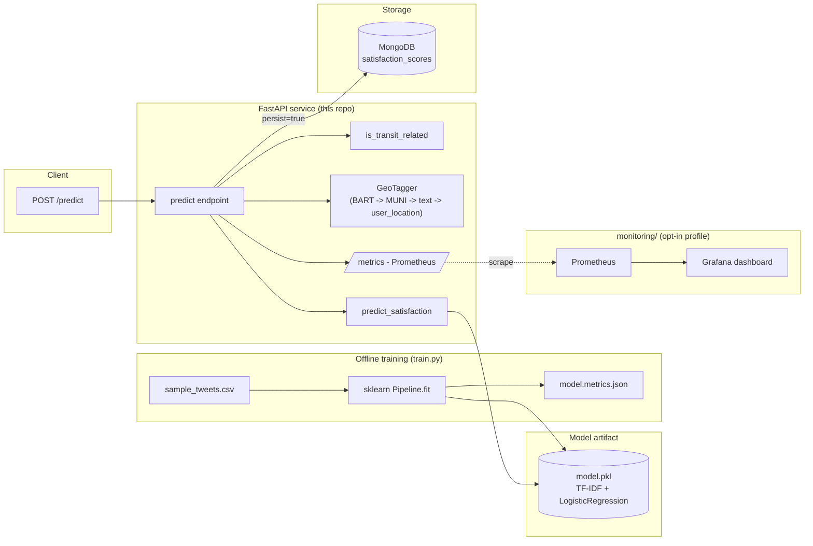

# Architecture

## Why it's shaped this way

**Training and serving are two different processes with one contract between them: the artifact.** `train.py` owns every modeling decision (features, algorithm, hyperparameters, evaluation). `predict.py` and the API know nothing about any of that -- they load a fitted `sklearn` pipeline and call `.predict_proba`. This is the same shape as an at-scale setup where a data science team retrains and versions a model independently of the team that operates the serving layer; the interface between them is deliberately thin.

**The DB layer is optional and non-blocking.** `/predict` always returns a score even if Mongo is down -- persistence is opt-in per request (`persist: true`) and failures are caught and logged rather than surfaced as a 500. A scoring endpoint going down because a downstream write failed is a worse failure mode than losing one row.

**Everything reads config from the environment**, never from source. This was the single biggest problem in the original project (a MongoDB URI with a plaintext password, and Twitter API keys, both committed to a public repo).

## What's out of scope on purpose

- **Real-time ingestion.** The original project streamed tweets directly via threads writing to local files. A production version of that would be Kafka/Kinesis, not threads -- but that's a separate ingestion service, not part of this API's job.
- **A fancier model.** TF-IDF + Logistic Regression is intentionally boring: it trains in under a second on a laptop with no GPU and no external model download, so the whole pipeline is reproducible by anyone who clones the repo. Swapping in fastText embeddings or a transformer is a change entirely inside `train.py` -- the API and tests wouldn't need to change.
- **Anything beyond text-based geo tiers.** `GeoTagger` uses the original project's real `muni.json` (BART stations, MUNI stops, generic city mention, user-location fallback -- see `docs/MODEL_DECISIONS.md`), but drops the tiers that needed live tweet fields the original had and this API doesn't (GPS coordinates, the tweet `place` bounding box) or an Excel-file building list this rebuild doesn't vendor.
